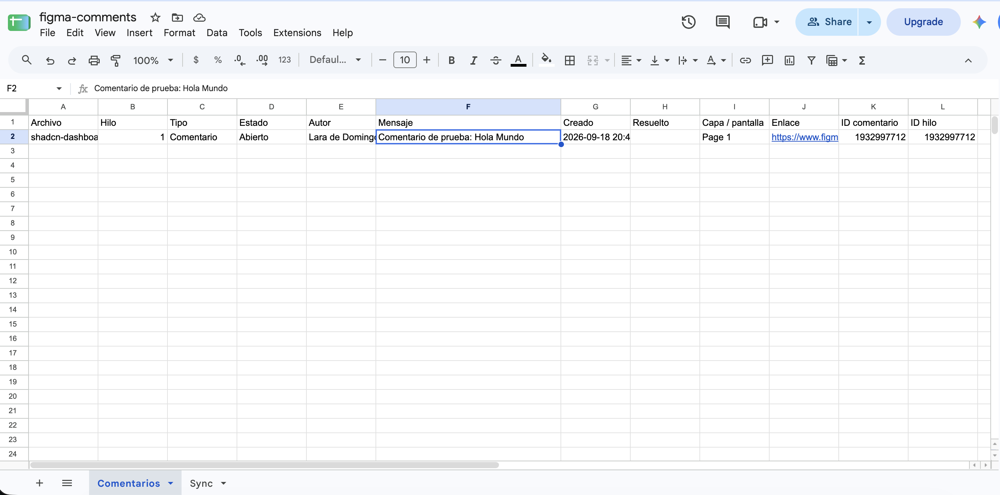

# figma-comment-exporter

Sincroniza los comentarios de uno o varios archivos de Figma (o de un proyecto entero) con una hoja de Google Sheets. Cada ejecución reescribe la pestaña `Comentarios`, así que los hilos resueltos o borrados en Figma quedan reflejados sin lógica de diferencias. La pestaña `Sync` guarda la fecha de la última sincronización, el número de filas y los avisos.

Puede ejecutarse en local o de forma programada con GitHub Actions (cada 30 minutos, de lunes a viernes de 8:00 a 20:00, hora de Madrid).

## Resultado

Así queda la pestaña `Comentarios` en Google Sheets tras una sincronización: una fila por comentario o respuesta, con su estado, autor, fecha, capa de Figma y un enlace directo al comentario.



## Requisitos

- Node.js 20.6 o superior
- Una cuenta de Figma con acceso a los archivos que quieres exportar
- Una cuenta de Google (para la hoja de cálculo y la cuenta de servicio)
- Una cuenta de GitHub, si quieres la ejecución programada

## Configuración

### Paso 1 · Token de Figma

1. En Figma, ve a **Settings → Security → Personal access tokens** y genera uno nuevo.
2. Dale estos permisos, todos de solo lectura:
   - comentarios (`file_comments:read`);
   - contenido de archivo (`file_content:read`), para sacar el nombre de la capa o pantalla;
   - metadatos (`file_metadata:read`), para el nombre del archivo;
   - proyectos (`projects:read`), solo si vas a sincronizar un proyecto entero.
3. Copia el token (empieza por `figd_`). Solo se muestra una vez.
4. Apunta en tu calendario cuándo caduca. Cuando caduque, el workflow fallará y GitHub te avisará por email.

**Límites de uso de la API.** Dependen de tu tipo de asiento, del endpoint y del plan donde esté el archivo. Por ejemplo, un archivo de un plan Starter admite solo 6 peticiones de contenido al mes. Los comentarios usan un endpoint con margen amplio. La página y el frame de cada comentario salen de un endpoint restrictivo (una petición por archivo, y solo si hay comentarios nuevos), así que el script los guarda en caché (`.cache/node-names.json`) y solo pide los nuevos. Los comentarios sobre una capa anidada dentro de un frame quedan sin página. Si no puede pedirlos, sigue sin ellos y lo anota en la pestaña `Sync`.

### Paso 2 · Cuenta de servicio de Google

El script escribe en la hoja con una **cuenta de servicio**: una cuenta de Google sin persona detrás, que solo tiene acceso a lo que compartas con ella.

#### 2.1 · Proyecto y API

En [Google Cloud Console](https://console.cloud.google.com/), crea un proyecto (o elige uno existente) y activa la **Google Sheets API**.

#### 2.2 · Crear la cuenta de servicio

1. Pulsa **Create credentials**.
2. En **Which API are you using?**, deja **Google Sheets API**.
3. En **What data will you be accessing?**, marca **Application data**. Es la opción de cuenta de servicio; **User data** es OAuth y no sirve aquí.
4. Pulsa **Next**.
5. En **Service account name** escribe, por ejemplo, `figma-sheets-sync`. El ID se rellena solo.
6. Pulsa **Create and continue**.
7. En **Grant this service account access to project (optional)** no asignes ningún rol. Pulsa **Continue** y luego **Done**. La cuenta no necesita permisos sobre el proyecto de Google Cloud, solo sobre la hoja, y eso se lo darás al compartirla.

#### 2.3 · Descargar la clave JSON

1. En el menú izquierdo, ve a **Credentials**. Abajo, en **Service Accounts**, verás la que acabas de crear.
2. Copia su email (`figma-sheets-sync@tu-proyecto.iam.gserviceaccount.com` o similar). Lo necesitarás en el paso 2.4.
3. Haz clic sobre la cuenta → pestaña **Keys** → **Add key** → **Create new key** → **JSON** → **Create**.
4. Se descargará un archivo `.json`. Renómbralo a `service-account.json` y muévelo a la carpeta del proyecto, junto a `sync.mjs` y `.env`. En [service-account.example.json](service-account.example.json) puedes ver los campos que contiene.

> Ese archivo contiene una clave privada. No lo compartas ni lo subas a ningún sitio; el `.gitignore` ya lo excluye del repositorio.

Si al crear la clave aparece un aviso de que la creación de claves está desactivada, lo más probable es que lo bloquee una política de la organización de Google Workspace. Pide a quien la administre que la levante, o usa un proyecto de tu cuenta personal de Google.

#### 2.4 · Crear y compartir la hoja

El email de la cuenta de servicio **no va en ningún archivo**: se usa para compartir la hoja con la cuenta, igual que la compartirías con una persona.

1. Ve a [sheets.google.com](https://sheets.google.com) y crea una hoja en blanco. Ponle un nombre, por ejemplo `Comentarios Figma`.
2. Pulsa **Compartir**, arriba a la derecha.
3. Pega el email de la cuenta de servicio (`...@...iam.gserviceaccount.com`). También aparece como `client_email` dentro del JSON.
4. Cambia el permiso a **Editor**.
5. Desmarca **Notificar a los usuarios**. La cuenta de servicio no tiene bandeja de entrada, y si lo dejas marcado puede aparecer un aviso de que no se pudo entregar.
6. Pulsa **Compartir** o **Enviar**. Si Google pregunta si quieres compartir con alguien de fuera de tu organización, confirma.

No crees pestañas: el script crea `Comentarios` y `Sync` la primera vez que se ejecute.

#### 2.5 · Copiar el ID de la hoja al `.env`

El ID está en la URL de la hoja, entre `/d/` y `/edit`:

```
https://docs.google.com/spreadsheets/d/1AbC...xyz/edit#gid=0
                                       └──────┘
                                       ID de la hoja
```

Copia `.env.example` como `.env` (si aún no lo has hecho) y pega el ID en `SHEET_ID`. La ruta al JSON ya apunta a `./service-account.json`:

```bash
SHEET_ID=1AbC...xyz
GOOGLE_SERVICE_ACCOUNT_FILE=./service-account.json
```

Para la ejecución en GitHub Actions no se usa el `.env`: el ID y el JSON se configuran como variable y secret en el paso 4.

### Paso 3 · Repositorio

Crea tu propia copia del proyecto como repositorio **privado** en GitHub, porque los comentarios pueden contener información de clientes: clona este repositorio y súbelo al tuyo, respetando la ruta `.github/workflows/figma-comments.yml`.

**Consumo:** unas 528 ejecuciones al mes de alrededor de 1 minuto. Entra de sobra en los 2.000 minutos gratuitos para repositorios privados. La regla de GitHub que desactiva las tareas programadas tras 60 días sin actividad solo se aplica a repositorios públicos; si el tuyo lo es y se detienen, reactívalas desde la pestaña Actions.

### Paso 4 · Secrets y variables

En tu repositorio, ve a **Settings → Secrets and variables → Actions**.

**Secrets**

| Nombre | Valor |
| --- | --- |
| `FIGMA_TOKEN` | Token personal de Figma |
| `GOOGLE_SERVICE_ACCOUNT_JSON` | Contenido completo del JSON descargado |

**Variables**

| Nombre | Valor |
| --- | --- |
| `SHEET_ID` | ID de la hoja de Google |
| `FIGMA_FILE_KEYS` | Claves de los archivos, separadas por comas. La clave es lo que va tras `/design/` en la URL del archivo (`figma.com/design/AbCdEf123456/Mi-archivo` → `AbCdEf123456`) |
| `FIGMA_FOLDER_ID` | En lugar de `FIGMA_FILE_KEYS`, si quieres todos los archivos de un proyecto |

### Paso 5 · Primera ejecución

1. En la pestaña **Actions → Sincronizar comentarios de Figma**, pulsa **Run workflow**.
2. Revisa el log. Deberías ver una línea por archivo con su número de comentarios.
3. En la hoja aparecerán dos pestañas:
   - `Comentarios`: archivo, nº de hilo, comentario o respuesta, estado (abierto o resuelto), autor, mensaje, fechas en hora de Madrid, capa y enlace directo al elemento en Figma.
   - `Sync`: fecha de la última sincronización y avisos.

**Para probar antes en local:** copia `.env.example` como `.env`, rellénalo y ejecuta:

```bash
npm install
npm run sync:local
```

| Variable de `.env` | Obligatoria | Descripción |
| --- | --- | --- |
| `FIGMA_TOKEN` | Sí | Token personal de Figma |
| `FIGMA_FILE_KEYS` | Esta o `FIGMA_FOLDER_ID` | Claves de archivo separadas por comas |
| `FIGMA_FOLDER_ID` | Esta o `FIGMA_FILE_KEYS` | ID del proyecto de Figma |
| `SHEET_ID` | Sí | ID de la hoja de Google |
| `GOOGLE_SERVICE_ACCOUNT_FILE` | Sí (local) | Ruta al JSON de la cuenta de servicio |

Variables opcionales:

- `SHEET_TAB`: nombre de la pestaña de comentarios (por defecto `Comentarios`).
- `FETCH_NODE_NAMES=false`: no consulta los nombres de capa.

### Paso 6 · Compartir con el equipo

- Comparte la hoja con el equipo como **Lector**, o protege la pestaña `Comentarios`.
- Cualquier cosa que escriban en esa pestaña se borrará en la siguiente sincronización.
- Si el equipo necesita añadir notas o acciones, que lo haga en otra pestaña, enlazada por la columna `ID comentario` con `BUSCARV` o `XLOOKUP`.

## Seguridad

- **Nunca subas `.env` ni `service-account.json`.** Ya están en `.gitignore`; solo se versionan `.env.example` y `service-account.example.json`, que contienen valores de ejemplo.
- Si un token o una clave llegan a publicarse por error, revócalos de inmediato (en Figma y en Google Cloud) y genera otros nuevos.
